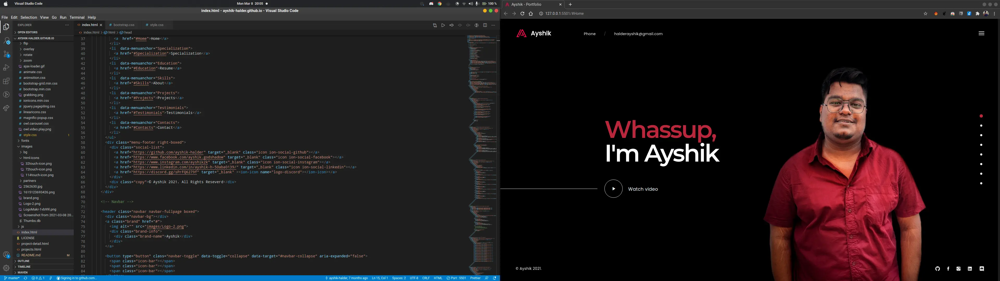

#  Personal Portfolio Page ~*Ayshik Halder*
> This repository contains the source code of the website!

##  Click to view my Page

## Screenshots

## Status
Website is still under development as of March 2021.
## Things to do
* Projects, Testimonials page completion.
* Responsiveness for Mobile browsers and other small form factors.
* Inclusion of Github repo links

## Licence
    Copyright (C) 2021 Ayshik Halder. All rights reserved - Licensed under GNU General Public License
    

  <i>You can reach me on given below places. Dont forget to star my Repositories and following me on GitHub for more content.</i>
  

    
    
  

  

